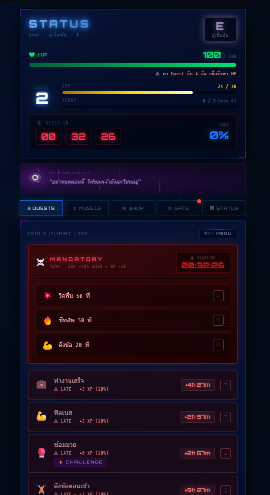
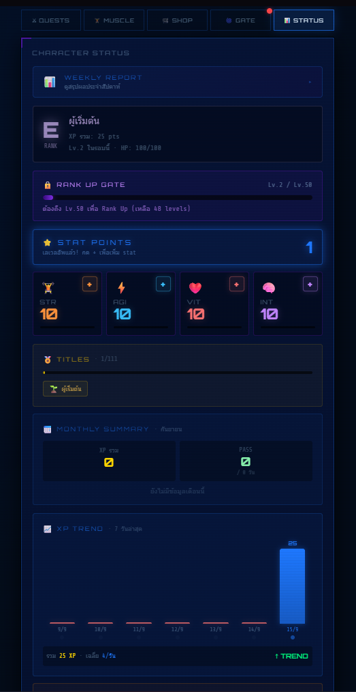
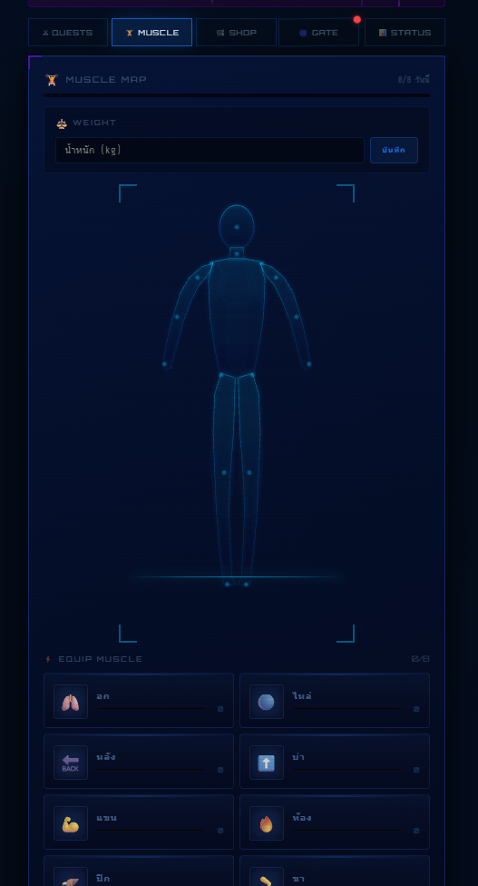
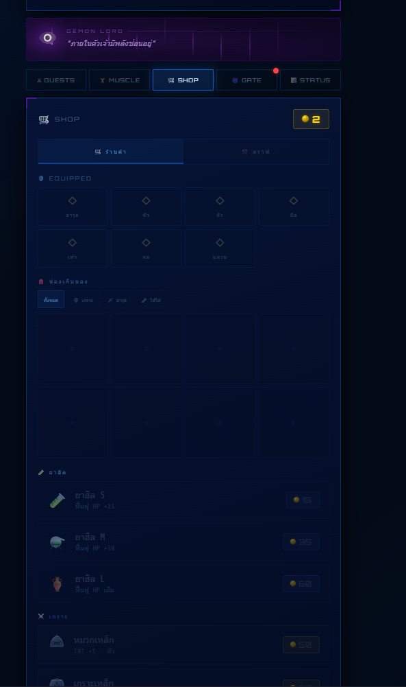
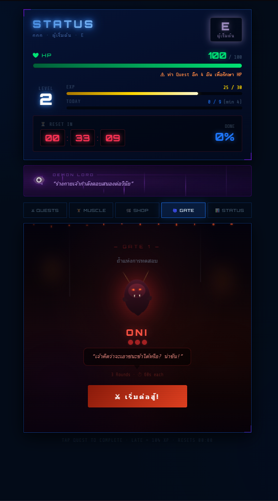
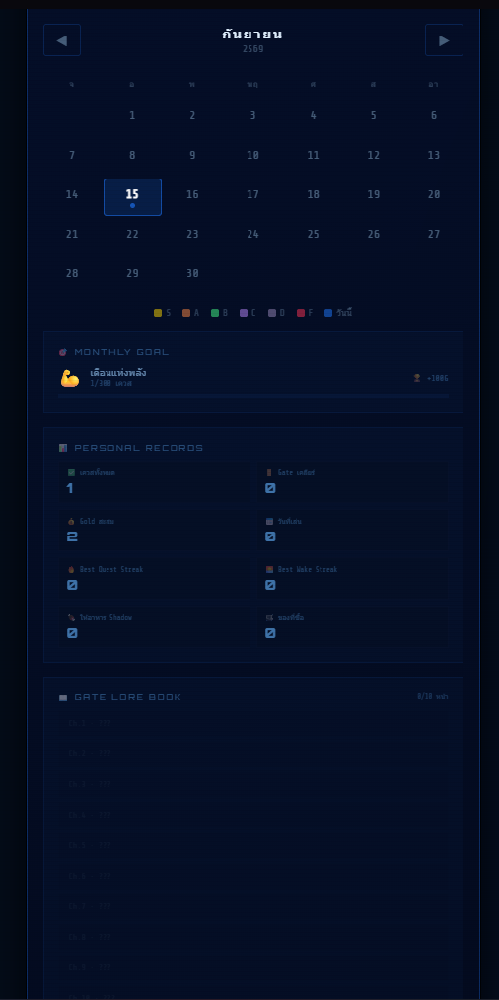
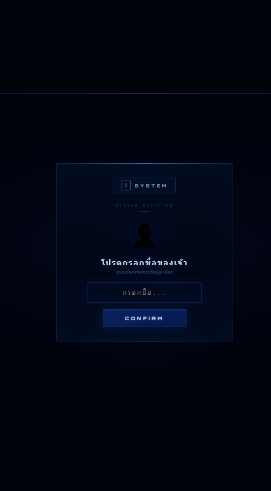

# Solo Growing — เว็บพัฒนาตัวเองในรูปแบบ RPG

<p align="center">
  <a href="https://solo-growing-jiraphat.boss596305.chatgpt.site"><strong>เปิดดู Solo Growing Preview →</strong></a>
</p>

> แอปพลิเคชันสำหรับติดตามการพัฒนาตัวเองผ่านระบบเควสต์ (Quest) คะแนนประสบการณ์ (XP) เงินรางวัล และการเติบโตของตัวละคร ออกแบบให้กิจวัตรประจำวันมีโครงสร้างและติดตามความคืบหน้าได้ง่ายขึ้น

- **Repository:**[JiraphatSrajan/SoloGrowing](https://github.com/JiraphatSrajan/SoloGrowing)
- **แพลตฟอร์ม:**React + Vite Web Application
- **สถานะ:**Public preview สำหรับสาธิตโปรเจกต์

## Project Overview

Solo Growing เป็นเว็บแอปพลิเคชันที่นำแนวคิดจากเกม RPG มาประยุกต์กับการพัฒนาตัวเอง ผู้ใช้สามารถบันทึกกิจกรรมในรูปแบบเควสต์ รับ XP และ Gold พัฒนาค่าสถานะของตัวละคร และติดตามประวัติการทำกิจกรรมผ่านหน้าจอเดียว

แนวคิดหลักของโปรเจกต์คือการเปลี่ยนกิจวัตรที่ทำเป็นประจำให้กลายเป็นเป้าหมายที่เห็นความคืบหน้าได้ชัดเจน โดยเน้นการใช้งานที่เข้าใจง่ายและเหมาะกับการติดตามด้วยตนเอง

Repository นี้จัดทำเป็นหน้าแนะนำโปรเจกต์สำหรับ Portfolio ส่วนโค้ดต้นฉบับของแอปพลิเคชันไม่ได้เผยแพร่ใน Repository สาธารณะนี้

## Core Features

### Quest และ Progression

- เควสต์ประจำวัน (Daily Quest)
- เควสต์เสริม (Side Quest)
- เควสต์ท้าทาย (Challenge Quest)
- ระบบ XP, Level และ Rank
- ทหารเงา คอยเฝ้าติดตาม
- ค่าสถานะตัวละคร เช่น STR, VIT, AGI และ INT

### Reward และระบบตัวละคร

- Gold และรางวัลจากการทำเควสต์
- Inventory สำหรับจัดการไอเท็ม
- Equipment และระบบเพิ่มค่าสถานะ
- Shop สำหรับแลกเปลี่ยนไอเท็ม
- Shadow Companion และความก้าวหน้าของตัวละคร

### Gate และ Dungeon

- Gate สำหรับปลดล็อกความท้าทายตามระดับ
- Dungeon ที่แบ่งเป็นรอบการทดสอบ
- รางวัลและไอเท็มจากการผ่านด่าน

### การติดตามข้อมูล

- Calendar และประวัติกิจกรรม
- Notes สำหรับบันทึกข้อมูลเพิ่มเติม
- Progress Summary สำหรับดูภาพรวม
- ระบบ Export ข้อมูลออกจากแอป และ Import ข้อมูล JSON กลับเข้าแอป
- รองรับการแสดงผลบน Desktop และ Mobile

## ระบบหลักของแอป

Solo Growing มีระบบย่อยหลายส่วนที่เชื่อมต่อกัน เพื่อเปลี่ยนการพัฒนาตัวเองให้เป็นประสบการณ์แบบ RPG และสามารถทดลองใช้งานได้จาก [Live Preview](https://solo-growing-jiraphat.boss596305.chatgpt.site/)

- ระบบเควสต์หลัก เควสต์เสริม และเควสต์บังคับ
- Status, Level, XP, HP, Rank และค่าสถานะตัวละคร
- Muscle System สำหรับบันทึกน้ำหนักและพัฒนาร่างกาย
- Shop, Inventory และ Equipment
- Gate และ Dungeon สำหรับความท้าทายแบบเป็นด่าน
- Calendar, Monthly Goal และ Personal Records
- First Login สำหรับตั้งค่าโปรไฟล์ครั้งแรก

### ภาพตัวอย่างระบบ

| ระบบ | ภาพตัวอย่าง |
| --- | --- |
| หน้าหลักเควส |  |
| Status และรายงานความก้าวหน้า |  |
| Muscle System |  |
| Shop และไอเท็ม |  |
| Gate และ Dungeon |  |
| Calendar และ Records |  |
| First Login |  |

> ภาพเหล่านี้เป็นหลักฐานการออกแบบและการทำงานของระบบใน Public Preview โดยยังมีระบบอื่น ๆ ให้ทดลองเพิ่มเติมในแอป

## User Flow

1. เริ่มต้นโปรไฟล์ผู้เล่น
2. เลือกเควสต์จากรายการที่มี
3. ทำเควสต์และรับ XP หรือ Gold
4. ใช้ความก้าวหน้าเพื่อพัฒนาระดับและค่าสถานะ
5. ตรวจสอบประวัติและสรุปผลการใช้งาน
6. Export ข้อมูลเพื่อเก็บเป็นข้อมูลสำรองเมื่อจำเป็น

## หลักการทำงานของระบบ

1. ผู้ใช้เริ่มต้นข้อมูลโปรไฟล์และค่าสถานะของตัวละคร
2. ระบบแสดงกิจกรรมในรูปแบบเควสต์ตามประเภทและเงื่อนไขของแต่ละรายการ
3. เมื่อทำเควสต์สำเร็จ ระบบคำนวณ XP, Gold และการเพิ่มค่าสถานะที่เกี่ยวข้อง
4. XP ที่สะสมจะนำไปคำนวณ Level และ Rank ของผู้เล่น
5. Inventory, Equipment และระบบรางวัลช่วยต่อยอดความก้าวหน้าของตัวละคร
6. ระบบบันทึกความคืบหน้าไว้ในพื้นที่จัดเก็บของเบราว์เซอร์
7. ผู้ใช้สามารถ Export ข้อมูลเป็น JSON และ Import กลับเข้าแอปเพื่อสำรองหรือกู้คืนข้อมูล

## Technology

| ด้าน | เทคโนโลยี |
| --- | --- |
| Frontend | React, JavaScript (JSX) |
| Build Tool | Vite |
| Styling | CSS และ Inline SVG |
| Data Storage | Browser Storage + JSON Export/Import |
| Development Environment | Visual Studio Code |
| Deployment | ChatGPT Sites Public Preview |

## Data และ Privacy

- ความคืบหน้าของผู้ใช้จัดเก็บในพื้นที่จัดเก็บของเบราว์เซอร์
- ยังไม่มีระบบบัญชีผู้ใช้หรือการซิงก์ข้อมูลข้ามอุปกรณ์
- มีฟังก์ชัน Export และ Import สำหรับสำรองและกู้คืนข้อมูลผ่านไฟล์ JSON
- ควร Export ข้อมูลก่อนล้างข้อมูลเบราว์เซอร์หรือเปลี่ยนอุปกรณ์
- โค้ดต้นฉบับของแอปพลิเคชันไม่ได้อยู่ใน Repository สาธารณะนี้

## วิธีเปิดดู Preview

1. กดปุ่ม **เปิดดู Solo Growing Preview**ด้านบน
2. เริ่มต้นข้อมูลผู้เล่น
3. เลือกเควสต์ที่ต้องการทำ
4. ทำเครื่องหมายเควสต์เมื่อเสร็จแล้ว
5. ตรวจสอบ XP, Gold, Level และสรุปความคืบหน้า

## Current Status

- เปิดให้เข้าชมผ่าน Public Preview แล้ว
- มีระบบเควสต์และการคำนวณความก้าวหน้าของตัวละคร
- รองรับการบันทึกข้อมูลและการสำรองข้อมูลผ่าน JSON
- รองรับการใช้งานบนหน้าจอ Desktop และ Mobile
- อยู่ระหว่างการปรับปรุงรายละเอียดและเตรียมเอกสารของโปรเจกต์เพิ่มเติม

## Repository Structure

```
SoloGrowing/
└── README.md    หน้าแนะนำโปรเจกต์และลิงก์ Preview
```

Repository นี้ใช้สำหรับอธิบายโปรเจกต์และแสดงลิงก์สาธิต โดยไม่เผยแพร่โค้ดต้นฉบับของแอปพลิเคชัน

## Developer

**Jiraphat Srajan (จิรภัทร สระจันทร์)**
